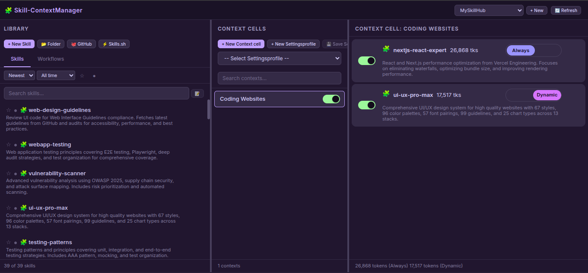

# Skill-ContextManager & MCP Server

[](https://github.com/One-Man-Company/Skills-ContextManager)

A self-hosted web application for managing AI skills, workflows, and contexts with full MCP (Model Context Protocol) integration. Organize, manage, and dynamically load specialized knowledge bases into any AI Agent just by toggling your Skills On/Off in simple local hosted WEB UI.




## Features

### Web Application
- **Skill & Workflow Management**: Create, edit, delete, and organize skills and workflows
- **Multi-Hub Support**: Create isolated workspaces with separate skills/contexts
- **Context Cells**: Organize skills/workflows into logical groups with enable/disable toggles
- **Dual Mode**: Choose Always-loaded (auto-loaded) or Dynamic (on-demand) skills by on/off toggle
- **File Editor**: Built-in editor with file tree, create/delete files & folders
- **Import Sources**:
  - 📂 **Folder**: Upload from local filesystem
  - 🐙 **GitHub**: Clone from GitHub repositories
  - ⚡ **Skills.sh**: Import from Skills.sh registry
- **AI Description Generation**: Auto-generate skill descriptions using AI APIs
- **Secure API Key Storage**: API keys stored with file mode 0600 (owner-only)
- **Settings Profiles**: Save and load configuration presets
- **Search & Filter**: Smart search, sort, favorites, active/inactive filters
- **Token Counting**: Track context size in tokens
- **Drag & Drop**: Move skills/workflows to contexts

### MCP Server
- **3 Essential Tools** for AI Agents:
  - `get_default_skills()` - Load skills with mode `"always_loaded"`
  - `list_available_skills()` - List all enabled skills with modes
  - `load_full_skill_context(name)` - Load dynamic skill on-demand
- **Hub-Aware**: Works with active hub from multiple workspaces
- **Mode Support**: `"always_loaded"` vs `"dynamic"` skill loading
- **Type Support**: Both Skills and Workflows

## Quick Start

```bash
# Clone the repository
git clone https://github.com/One-Man-Company/Skills-ContextManager.git
cd Skills-ContextManager

# Install everything and copy starter skills to library
./setup.sh

# Start web application
cd Skill-ContextManager && npm start
```

Access: `http://localhost:3000`

MCP configuration saved to `mcp_settings.json` - add this to your AI Agent's MCP settings.

> ⚠️ **Important**: Copy the content of `MCP_instructions.md` to your AI Agent's System prompt or rules configuration.

## MCP Configuration

The `setup.sh` script generates `mcp_settings.json` with correct paths. Add it to your AI Agent's MCP settings file:

```json
{
  "Skills-ContextManager": {
    "command": "/absolute/path/Skills-MCP/.venv/bin/python3",
    "args": ["-u", "/absolute/path/Skills-MCP/mcp_server.py"],
    "env": {}
  }
}
```

## MCP Tools

AI Agents need only these 3 tools. Usage details are in `MCP_instructions.md` (system prompt):

| Tool | Description |
|------|-------------|
| `get_default_skills()` | Load all skills with mode `"always_loaded"` into context |
| `list_available_skills()` | List all enabled skills with descriptions and modes |
| `load_full_skill_context(name)` | Load a specific skill on-demand (for mode `"dynamic"`) |

### mcpservers.org Submission

| Field | Value |
|-------|-------|
| Name | Skills-ContextManager |
| Description | Web UI for managing AI skills with MCP integration |
| Repository | https://github.com/One-Man-Company/Skills-ContextManager |
| Command | `[path]/Skills-MCP/.venv/bin/python3` |
| Args | `-u [path]/Skills-MCP/mcp_server.py` |

## Included Skills & Workflows

The repository includes starter content in `MySkillsHUB/`:

**Skills (39):**
architecture, behavioral-modes, clean-code, code-review-checklist, documentation-templates, frontend-design, game-development, i18n-localization, mobile-design, nextjs-react-expert, nodejs-best-practices, parallel-agents, performance-profiling, python-patterns, seo-fundamentals, server-management, skill-creator, systematic-debugging, ui-ux-pro-max, vulnerability-scanner, webapp-testing, api-patterns, and more.

**Workflows (3):**
- best-standard-autonomous-coding
- elite-cognitive-operator-system
- plan-mode

All content is automatically copied to your library on first setup.

## License

MIT License

---

**Created**: February 2026
